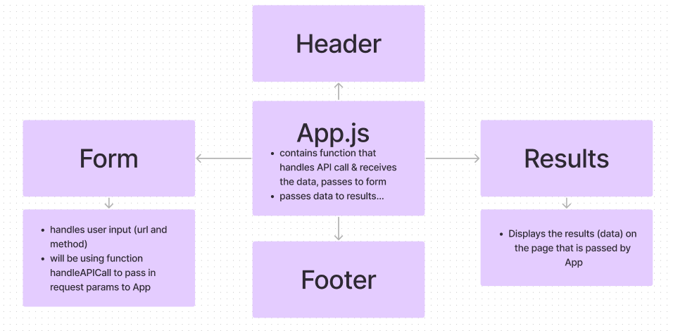

# RESTy 
- To run application: `npm start`.

## Lab 26: Component Based UI

### Goals:
- Convert all child components of `javascript <App />` from classes to functional components. 
- Use .scss files to style each component.
- Core application functionality should remain unchanged.

### PRs/Commits
- [Commit 1](https://github.com/stacyyuu/resty/commit/f7cc7e09db59557c649ad52dd457b6dd7de2456c)
- [GitHub Actions](https://github.com/stacyyuu/resty/actions/runs/4310988584/jobs/7519946634)

## Lab 27: useState() Hook

### Goals:
- Refactor any components using `this.setState()` to implement the `useState()` react API Hook.
- Refactor the Form component to implement user input from form elements, instead of hard coded string values. 

### PRs/Commits
- [Commit 1](https://github.com/stacyyuu/resty/commit/f7cc7e09db59557c649ad52dd457b6dd7de2456c)
- [GitHub Actions](https://github.com/stacyyuu/resty/actions/runs/4310988584/jobs/7519946634)

### UML

